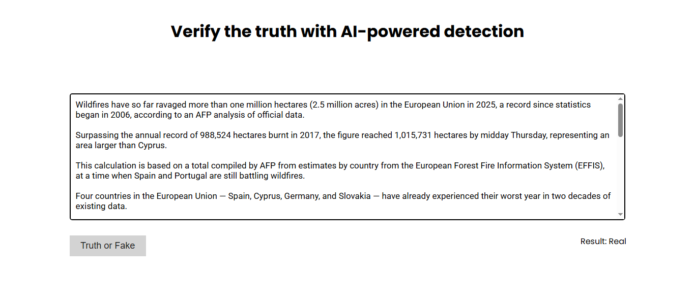

# 📰 Fake News Detection Model

A **machine learning-based web application** built with **Flask** to classify news articles as **Real** or **Fake**.

## 🔍 About

Fake News Detection uses AI and machine learning to automatically detect whether a given news article is authentic or fake.  
It demonstrates training a machine learning model and deploying it via Flask, allowing users to input news text and get instant predictions. 🚀

---

## ✨ Features

- 📰 Classifies news as **Real** or **Fake**  
- 🖥️ User-friendly web interface built with Flask  
- 🤖 Machine Learning model trained with scikit-learn  
- ⚡ Fast and responsive predictions  
- ⏱️ 0.5-second delay feature to simulate real-time detection  

---

## 🛠️ Technologies

- 🐍 Python  
- 🌐 Flask  
- 📊 scikit-learn  
- 🗄️ pandas, numpy  
- 🎨 HTML/CSS for frontend  

---

## 🖼️ Screenshot / Demo

  

---

## 📄 License

This project is licensed under the MIT License – see the [LICENSE](LICENSE) file for details.

---

**Made with ❤️ by [M Muzammil Irshad]**
